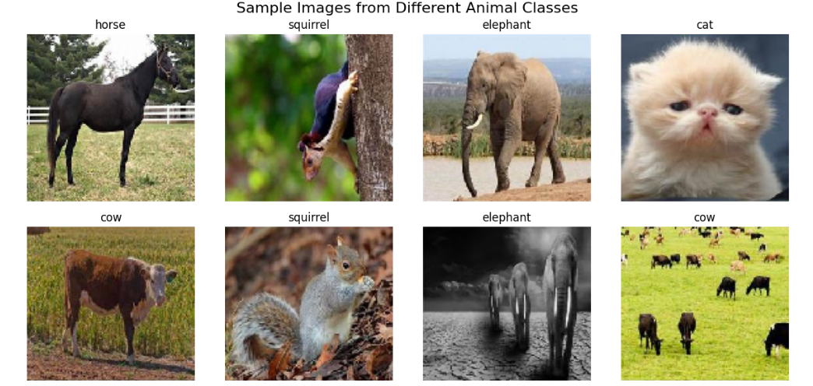

# 👁️‍🗨️ Computer Vision Projects

Welcome to my collection of **Computer Vision** projects. This repository features various applications that leverage image processing, deep learning, and visual data analysis to solve real-world problems.

  

## 📁 Projects Included

| Project Name                 | Description                                                                 |
|------------------------------|-----------------------------------------------------------------------------|
| **Animals Classification (VGG pre-trained model)**      | Classifies images into categories using Convolutional Neural Networks (CNNs) with TensorFlow and Keras. |
| **Butterflies Classification**          | Detects and labels multiple objects within images using pre-trained models like YOLO and SSD. |
| **Santa Claus Classification+Regularization**       | Identifies whether individuals in images are wearing face masks using transfer learning. |

---

## 🔧 Technologies Used

- Python  
- OpenCV  
- TensorFlow / Keras  
- PyTorch (in select projects)  
- NumPy / Pandas  
- Matplotlib / Seaborn  
- Jupyter Notebook  
